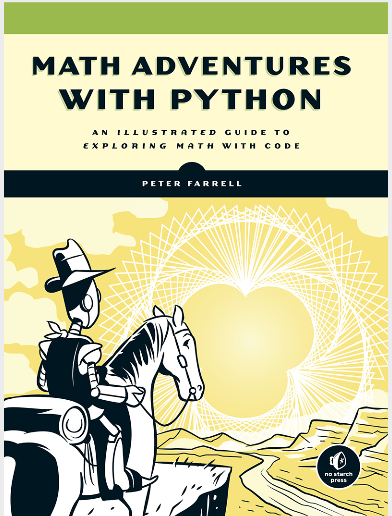

# Math_Python
- 참고도서 

- 참고영상 
  Master Math by Coding in Python  <a href="https://www.udemy.com/course/math-with-python/?utm_source=adwords&utm_medium=udemyads&utm_campaign=DSA_Catchall_la.EN_cc.ROW&utm_content=deal4584&utm_term=_._ag_88010211481_._ad_398022934994_._kw__._de_c_._dm__._pl__._ti_dsa-404285868850_._li_1030724_._pd__._&matchtype=b&gclid=Cj0KCQiA6IHwBRCJARIsALNjViUJwqev3Qbj-tTjrhxY83l1N8GeZdHWl1QrLBhL6nA_xYevpla5QqUaAvIoEALw_wcB">[바로가기 - Go]</a> 
- 수학문제를 Python을 이용해 풀겠습니다. 
